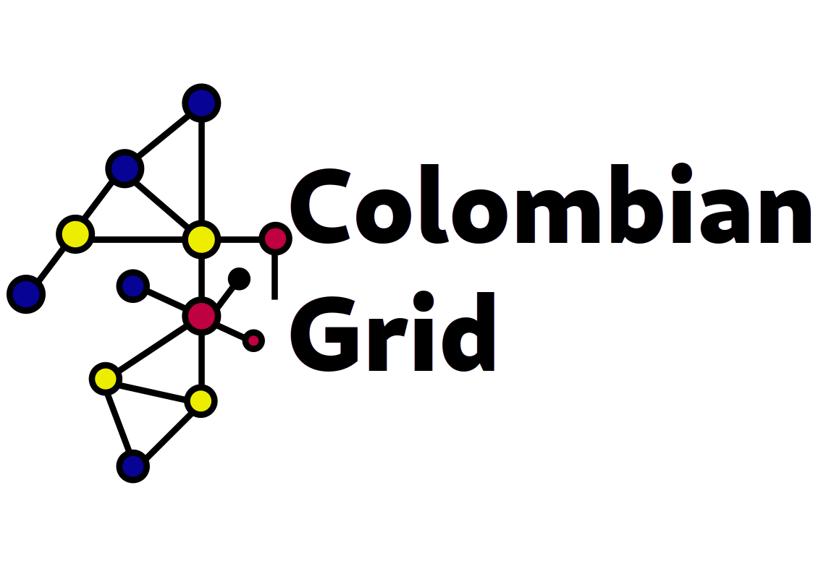

<div align="center">
  <h1 align="center">Digitizing the Colombian Grid</h1>
  <h3 align="center">Carry all the information of the Colombian grid with you</h3>
</div>

<div align="center">
  <!-- PROJECT LOGO -->
  <br />
      
  <br />
  <p><i>The digitization of the Colombian grid in one line</i></p>
</div>

---

✨⚡ Query, extract, and process available information from the Colombian energy market with Python.

## About The Project

`colombian-grid` is a Python library designed to provide a simple and efficient interface to access and process public data from the Colombian electricity market.

### Key Features

- 🧠 **Generators**: Query detailed information about the current power generators in the market.
- 📊 **Data Extraction**: Easily extract data sets for analysis and reporting.
- 🐍 **Pythonic**: A clean, intuitive, and easy-to-use API.

## Installation

### PyPI

```bash
pip install colombian-grid
```

## Usage

Here's a quick example of how to get started and fetch information about the generators.

```python
from colombian_grid.generators import get_generators_info

# Fetch a pandas DataFrame with information about all generators
generators_df = get_generators_info()

# Display the first 5 rows of the DataFrame
print(generators_df.head())
```

## Have questions or suggestions?

Check out our [documentation](https://jccamargo94.github.io/colombian-grid/) or open an issue in our repository. We are here to help you. 😊
